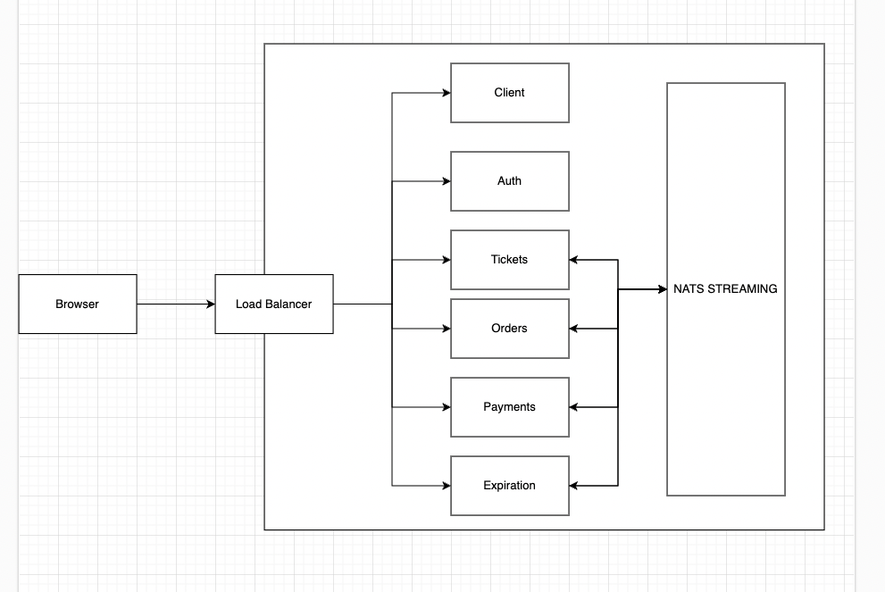
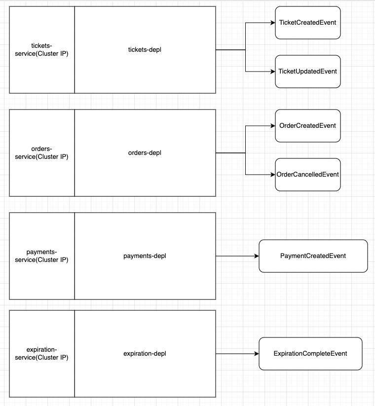

# Ticketing (MICROSERVICES K8S)

## How to run

### On localhost

- Mac Desktop with Kubertenes enable (Settings -> Kubernets -> Enable Kubernetes)
- Required resources: in my case 4CPUs and 8GB Ram (Settings -> Resources)
- Add this line in /etc/hosts: `127.0.0.1 ticketing.dev`
- Adding these secrets k8s:
  - `kubectl create secrets generic jwt-secret --from-literal JWT_KEY=<YOUR-SECRET>`
  - `kubectl create secrets generic stripe-secret --from-literal STRIPE_KEY=<STRIPE-SECRET>`
  - `kubectl create secrets generic stripe-public-key --from-literal STRIPE_PUBLIC_KEY=<STRIPE-PUBLIC-KEY>`
- Running this line to create LoadBalancer and Nginx-Ingress:
  - `kubectl apply -f https://raw.githubusercontent.com/kubernetes/ingress-nginx/controller-v1.8.1/deploy/static/provider/cloud/deploy.yaml`
- run theses 2 commands to create deployments/services/routers:
  - `kubectl apply -f infra/k8s`
  - `kubectl apply -f infra/k8s-dev`
- Delete k8s cluster in load balancer/nginx-ingress:
  - `kubectl delete -f infra/k8s`
  - `kubectl delete -f infra/k8s-dev`
  - `kubectl delete -f https://raw.githubusercontent.com/kubernetes/ingress-nginx/controller-v1.8.1/deploy/static/provider/cloud/deploy.yaml`
- Go to https://ticketing.dev/, and might need to type this when showing alert page: `this is unsafe`
- To restart a service with newest image update:
  - `kubectl rollout restart deployment auth-depl`

### On Google Cloud

- Create a project in google cloud
- Go to Kubernetes -> Create Cluster -> Switch To Standard Mode -> Node -> Choosing instance E2 with 2gb ram and 20GB SSD memory is already enough
- Installing gcloud:
  - `brew install --cask google-cloud-sdk`
  - `gcloud components install gke-gcloud-auth-plugin`
- Setting to gcloud k8s context:
  - `gcloud auth login`
  - `gcloud container clusters get-credentials <cluster-name>`
- Checking with command:
  - `kubectl config get-contexts`
- If we are in localhost context, to switch to gcloud context, use this commands:
  - `kubectl config use-context <context-name>`
- Adding these secrets k8s: [Same with in localhost]
- Running this line to create LoadBalancer and Nginx-Ingress:
  - `kubectl create clusterrolebinding cluster-admin-binding \
--clusterrole cluster-admin \
--user $(gcloud config get-value account)`
  - `kubectl apply -f https://raw.githubusercontent.com/kubernetes/ingress-nginx/controller-v1.8.1/deploy/static/provider/cloud/deploy.yaml`
- run theses 2 commands to create deployments/services/routers: [Same with in localhost]
- Delete k8s cluster in load balancer/nginx-ingress: [Same with in localhost]
- Go to Networking -> LoadBalancer -> Copy the LoadBalancer IP
- Add this line in /etc/hosts: `<LoadBalancer IP> ticketing.dev`
- Go to https://ticketing.dev/, and might need to type this when showing alert page: `this is unsafe`
- To restart a service with newest image update:
  - `kubectl rollout restart deployment auth-depl`

#### Run as developing mode:

##### On Localhost

- Install skaffold for development: brew install skaffold
- Pull these 2 images as when skaffold pull itself, usually make erros :((
  - `docker image pull docker`
  - `docker image pull redis`
- Run this command to start as developing mode:
  - `skaffold dev`
- To exit: `Ctrl + C`

##### On GCloud

- Enable Gcloud Build in Google Cloud
- Install skaffold for development: brew install skaffold
- Pull these 2 images as when skaffold pull itself, usually make erros :((
  - `docker image pull docker`
  - `docker image pull redis`
- Updating in `skaffold.yml` file, with:

```
build:
  # local:
  #   push: false
  googleCloudBuild:
    projectId: custom-ticketing-dev
  artifacts:
    - image: us.gcr.io/<your-project-name>/auth
```

apply this to the other artifaces such as [client/auth/orders/tickets/payments/expirations] in `skaffold.yml`

- Run this command to start as developing mode:
  - `skaffold dev`
- To exit: `Ctrl + C`

## CI/CD

- in github actions, i have already written script to test and deploy to `[OCEANDIGITAL or GCLOUD]`

### In OCEAN DIGITAL

- create clusters with 3 nodes, each node has 2gb ram
- install doctl:
  - `brew install doctl`
- go to API -> Generate new token -> COPY it:
  - `doctl auth init <token>`
- Checking Context with command:
  - `kubectl config get-contexts`
- Switching context with command:
  - `kubectl config use-context <context-name>`
- Installing load balancers/nginx-ingress:
  - `kubectl apply -f https://raw.githubusercontent.com/kubernetes/ingress-nginx/controller-v1.8.1/deploy/static/provider/do/deploy.yaml`
- Go to the repo -> setting these secrets actions:
  - `DOCKER_USERNAME`
  - `DOCKER_PASSWORD`
  - `DIGITALOCEAN_ACCESS_TOKEN`
- Go to .github/deployment-\* -> comment GCLOUD part and uncomment OCEAN DIGITAL one.

#### DOMAIN NAME:

- Go to `namecheap.com` buy a domain
- Domain List -> NAMESERVERS -> CUSTOM DNS:
  - `ns1.digitalocean.com`
  - `ns2.digitalocean.com`
  - `ns3.digitalocean.com`
- Go back to Digital Ocean -> Networking -> Domains -> Input bought domain -> Add Domain
- Set A HOSTNAME with `@`, WILL DIRECT TO with `<your-load-balance-ip>` and TTL 30s -> Create Record
- Set CNAME HOSTNAME with `www`, IS AN ALIAS OF `@` and TTL 30s -> Create Record
- Update in `infra/k8s-prod` "host" with the domain name you just bought
- [Optional] Due to not configure https connection, go to each services "src/app.ts", set:

```
  cookieSession({
    signed: false,
    secure: false,
  })
```

### In GCLOUD

- create clusters with 3 nodes, each node has 2gb ram
- install gcloud: [Same on running with google cloud]
- Checking Context with command:
  - `kubectl config get-contexts`
- Switching context with command:
  - `kubectl config use-context <context-name>`
- installing load balancer/nginx-ingress: [Same in running with Gcloud]
- Go to IAM -> WORKLOAD IDENTITY FEDERATION -> create pool -> settings mapping attibute
  - `google.subject=assertion.sub`
  - `attribute.actor=assertion.act`
  - `attribute.aud=assertion.aud`
- enabling `IAM Service Account Credentials API`
- Go to IAM -> Service Accounts -> Create account -> Grant `Service Account Token Creator role` and `Secret Manager and Secret Accessor`
- Go to the repo -> setting these secrets actions:
  - `DOCKER_USERNAME`
  - `DOCKER_PASSWORD`
  - `WORKLOAD_IDENTITY_PROVIDER`
  - `SERVICE_ACCOUNT`
- Go to .github/deployment-\* -> comment GCLOUD part and uncomment OCEAN DIGITAL one.

## DESCRIPTION:

### Infrastructure



### Publishing Events Infrastructure


